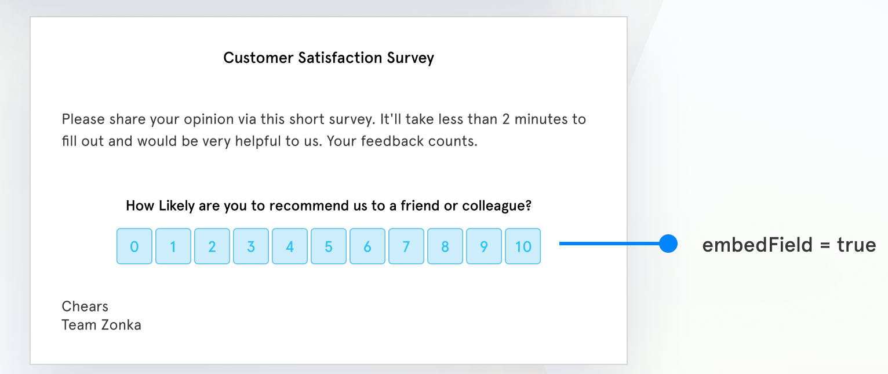

# Send Email Survey

You can refer to the Zonka Feedback Send  Email Survey API documentation [here ](https://apidocs.zonkafeedback.com/#f4ce848c-898b-4004-8521-acc3456f1b9f)and learn more from the sample request and responses provided.

## Basic Email Survey

To send out a quick Email Survey using API you need just the required parameters to be passed. If any of the optional parameters are not passed the default email template that has been saved for the particular survey will be sent. If any of the Optional parameters are passed the sections of the email corresponding to the parameters passed will be overwritten.[
](https://apis.zonkafeedback.com/sendemail)

The below are the required parameters for an email survey&#x20;

| Parameter  | Value  | Description                                                     |
| ---------- | ------ | --------------------------------------------------------------- |
| `surveyId` | string | Survey Id of the survey to be sent                              |
| `email`    | string | Email address of the recipient to which the email is to be sent |

The below is a list of non-mandatory variables to customize the content of an email survey

| Parameter   | Value  | Description                               |
| ----------- | ------ | ----------------------------------------- |
| `name`      | string | Name of the recipient                     |
| `subject`   | string | Subject of the email                      |
| `message`   | string | Content for message body of the email     |
| `signature` | string | Signature content at the end of the email |

<figure><figcaption></figcaption></figure>

### Embed a Survey Question &#x20;

Zonka Feedback supports two types of email survey templates: with a Button or with an Embedded Question.&#x20;

To embed a Survey question in your email survey, set the embedField as 'True'.

<table><thead><tr><th width="170">Parameter</th><th width="161">Datatype</th><th>Description</th></tr></thead><tbody><tr><td><code>embedField</code></td><td>boolean</td><td>Enables you to select if the first question in your survey should be embedded in the email. Set as <code>true</code> to embed.</td></tr></tbody></table>

<figure><figcaption></figcaption></figure>

Additionally you can add gradient to your NPS and CES question options by using the variable below.&#x20;

<table><thead><tr><th width="290.3333333333333">Parameter</th><th width="157">Value</th><th>Description</th></tr></thead><tbody><tr><td><code>embedFieldButtonGradient</code></td><td>boolean</td><td>Gradient for NPS and CES button. Set as <code>true</code> if you want to set gradient</td></tr></tbody></table>

<div>

<figure><figcaption></figcaption></figure>

 

<figure><figcaption></figcaption></figure>

</div>


Please note that you should have a single-choice question as the first question in your survey if you want to send an email survey with an Embedded question.


### Embed a Survey Button&#x20;

To embed a Survey button in your email survey, set the embedField as 'False'.

<table><thead><tr><th width="270">Parameter</th><th width="161">Datatype</th><th>Description</th></tr></thead><tbody><tr><td><code>embedField</code></td><td>boolean</td><td>Set it as <code>false</code> if a Start Survey button should be included.</td></tr></tbody></table>

<figure><figcaption></figcaption></figure>

## Customizing Email

You can customize the email survey with some additional parameters such as a customized subject, message, and other parameters mentioned in the table below.

You can pass values for the components to customize the email look and feel along with the required parameters. Read how to find the hex code for your desired colors [here](https://htmlcolorcodes.com/).

| Parameter         | Value  | Description                                            |
| ----------------- | ------ | ------------------------------------------------------ |
| `heading`         | string | Content of heading text                                |
| `headingColor`    | string | Color of the heading text. Enter color Hex code        |
| `buttonText`      | string | Content of the button                                  |
| `buttonTextColor` | string | Color of the button bext. Enter color Hex code         |
| `buttonColor`     | string | Color of the Start Survey button. Enter color Hex code |

## Schedule Email&#x20;

You can schedule the email survey to be sent later as well by sending a value for the `scheduleDateTime` parameter. With this, you can set up the exact date and time when the survey email should be sent from the Zonka Feedback to the recipient.

<table><thead><tr><th width="282">Parameter</th><th width="161.33333333333331">Value</th><th>Description</th></tr></thead><tbody><tr><td><code>scheduleDateTime</code></td><td>date</td><td>Specify a future Date and Time for which the email survey is to be scheduled, in the format of <a href="./#date-and-time">YYYY-MM-DDThh:mm:ssTZ</a></td></tr></tbody></table>

## Reminder Email

At times, people don't respond to the survey invitation email and so they need to be nudged again to take the survey. When reminded, many of them complete the survey. Thus, reminder emails help improve the completion rate.

You can set up reminders for email surveys by providing values for these additional parameters.

<table><thead><tr><th>Parameter</th><th width="160.33333333333331">Value</th><th>Description</th></tr></thead><tbody><tr><td><code>reminder</code></td><td>string</td><td>Set as <code>true</code> if you want to send a reminder to recipients who do not fill the survey.</td></tr><tr><td><code>reminderMaxCount</code></td><td>string</td><td>Numbers of reminders you want to send if the recipient does not respond to the original survey email.</td></tr><tr><td><code>reminderSendAfter</code></td><td>string</td><td>Reminder to be sent how many days after the original survey email is sent</td></tr><tr><td><code>reminderMessage</code></td><td>string</td><td>Specify the Reminder Email message</td></tr></tbody></table>

## Send to Contact Lists

Zonka Feedback supports two types of Contact Lists and Segments: Dynamic and Static. You can send email surveys to multiple recipients by adding them to these contact lists and specifying the list name in the Send Email Survey API. &#x20;

| Parameter | Value | Description                                                     |
| --------- | ----- | --------------------------------------------------------------- |
| `list`    | array | Specify the Contact List names to which the email is to be sent |


You can fetch a list of Contact Lists in your account using the [GET Contact Lists API](https://apidocs.zonkafeedback.com/#1cdca186-e86f-45c4-9a85-f6e3bcb2f872)


## Send Additional Data

You can pass additional data as post parameters in the Send Email Survey API. You will be able to send Survey, Contact, and Hidden variables. To pass these variables you will need to use the `attributes` parameter.

| Parameter    | Value                      | Description                           |
| ------------ | -------------------------- | ------------------------------------- |
| `attributes` | object with key-value pair | Key-value pair of survey attributes.  |

#### Using Custom Variables via API

Occasionally, just by looking at where a respondent viewed the survey link, you will know certain details about them before they ever answer your survey. Custom variables let you send data through the survey web link and APIs, which may then be shown inside the survey and on any reports the survey generates. Please read more about supported variables [here](https://help.zonkafeedback.com/en/articles/5336596-personalize-your-questionnaire-with-our-custom-variables).

Zonka Feedback supports three types of custom variables -

1. Survey Variables
2. Contact Variables
3. Hidden Variables

```json
attributes
 {
      "flight_number": "EK 234",
      "flight_date": "10-10-2022",
      "flight_destination": "Barcelona",
      "contact_email":"carpenterj@xyz.com"
 }
```

## Set up Email Survey Throttling&#x20;

By default, Survey Throttling is set to 30 days for your Zonka Feedback account. That means emails will not be delivered to a recipient for the next 30 days if sent today. This setting can be changed or switched off from the Web App. While sending Email Surveys via API you can set this setting to be ignored.

<table><thead><tr><th width="287.3333333333333">Parameter</th><th>Value</th><th>Description</th></tr></thead><tbody><tr><td><code>ignoreThrottling</code> </td><td>boolean</td><td>Set as <code>true</code> if you want to ignore your survey throttling settings, <code>false</code> if not.</td></tr></tbody></table>

## Getting Help <a href="#getting-help" id="getting-help"></a>

If you need any help regarding the APIs please reach out to us at <mark style="color:blue;">hello@zonkafeedback.com.</mark>
